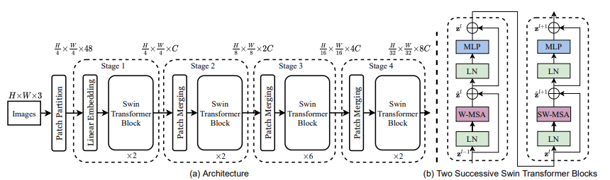
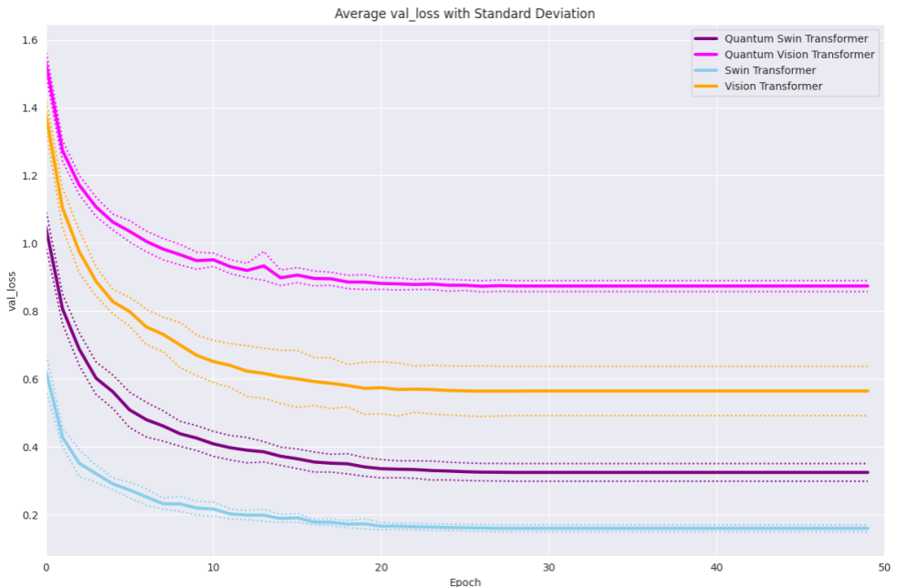
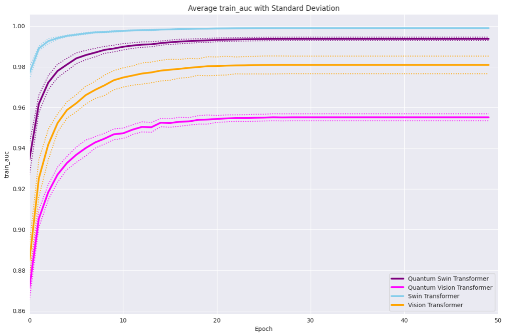

# Quantum Swin Transformers

**Master Project**

This repository contains the implementation and results from a Master's practical course (Masterpraktikum) project focusing on quantum-enhanced transformer architectures.

## Abstract

We present a model that combines two improvements over the classical vision transformer, namely a Swin transformer with variational quantum circuits. We successfully train this quantum model on the MNIST dataset using only classical hardware. To assess its performance, we compare it to several baseline models, including a classical vision transformer, a classical Swin transformer, and a quantum vision transformer, all trained under similar conditions. Our results show that our model benefits both from the improved speed-accuracy trade-off of the Swin transformer and the reduced parameter count of the quantum vision transformer.

## Project Overview

This repository contains implementations of quantum-enhanced transformer architectures, specifically combining Swin Transformers with variational quantum circuits for computer vision tasks.

## Installation

This project uses Poetry for dependency management. Install dependencies with:

```bash
poetry install
```

## Requirements

- Python >=3.11, <3.12
- CUDA 12.1 support
- JAX with CUDA support
- PyTorch with CUDA support
- Various quantum computing libraries (PennyLane, Qiskit, Cirq)

## Architecture

### Model Architectures

The project implements several transformer architectures:


*Quantum Vision Transformer (QViT) Architecture*


*Swin Transformer Architecture*


*Quantum Swin Transformer Blocks*


*Variational Quantum Circuit used in quantum layers*

### Dataset


*Sample MNIST digits used for training and evaluation*

## Usage

The main implementations can be found in the `src/quantum_transformers/` directory.

## Evaluation

We evaluated the performance of our proposed Quantum Swin Transformer (QSwinT) against baseline models: Quantum Vision Transformer (QViT), Swin Transformer (SwinT), and Vision Transformer (ViT). All models were trained for 50 epochs on the MNIST dataset using eight different random seeds to ensure statistical significance.

### Performance Comparison

#### Training Time Analysis
| Model | Total Time (hh:mm:ss) | Time per Epoch (s) | Time per Batch (s) |
|-------|----------------------|-------------------|-------------------|
| ViT | 00:16:06 | 19.32 | 0.011 |
| QViT | 00:29:43 | 35.66 | 0.021 |
| SwinT | 00:17:34 | 21.08 | 0.012 |
| QSwinT | 01:54:48 | 137.76 | 0.082 |

#### Memory Usage
| Model | Memory Usage |
|-------|-------------|
| ViT | 697 MiB |
| QViT | 708 MiB |
| SwinT | 592 MiB |
| QSwinT | 594 MiB |

#### Test Accuracy Results
| Model | Average Accuracy ± Std. Deviation |
|-------|-----------------------------------|
| ViT | 0.8267 ± 0.0262 |
| QViT | 0.7174 ± 0.0083 |
| SwinT | 0.9516 ± 0.0023 |
| QSwinT | 0.8988 ± 0.0061 |

#### AUC Score Results
| Model | Average AUC Score ± Std. Deviation |
|-------|-----------------------------------|
| ViT | 0.9814 ± 0.0039 |
| QViT | 0.9547 ± 0.0020 |
| SwinT | 0.9981 ± 0.0002 |
| QSwinT | 0.9925 ± 0.0009 |

### Training Time and Memory Usage Analysis

The training time analysis reveals significant differences between classical and quantum models. Classical models (ViT and SwinT) train in approximately 16-17 minutes, while quantum variants require substantially longer: QViT takes nearly 30 minutes and QSwinT almost two hours. The QSwinT model's training time per batch is almost eight times longer than the classical SwinT model, explaining the extended total training time.

Regarding memory usage, SwinT and QSwinT models use less memory during training than their ViT counterparts. Quantum variants consume slightly more memory than their classical versions: QSwinT uses only 2 MiB more than SwinT, while QViT consumes 11 MiB more than ViT. This demonstrates that quantum components do not significantly increase memory burden.

**IBM Quantum Computer Insight**: Our attempt to run the QSwinT model on the IBM Quantum Computer revealed that one training epoch would require at least 150 hours, highlighting the computational complexity of real quantum hardware versus classical simulation.

### Key Findings

1. **Performance Ranking**: SwinT achieved the best results, followed by QSwinT, ViT, and QViT
2. **Quantum Enhancement**: QSwinT outperforms both ViT and QViT despite using quantum circuits
3. **Training Time**: Quantum models require significantly longer training times (QSwinT: ~8x longer per batch than SwinT)
4. **Memory Efficiency**: Quantum variants show minimal memory overhead compared to classical counterparts
5. **Convergence**: All models converge after approximately 30 epochs with typical "zig-zag" behavior in early epochs

### Training and Validation Results

#### Loss Analysis


*Average training loss with standard deviation for ViT, QViT, SwinT, and QSwinT. All models converge after 30 epochs at the latest, with classical variants achieving smaller loss values than their quantum counterparts. The SwinT model has the smallest loss value while QViT shows the highest.*


*Average validation loss with standard deviation for ViT, QViT, SwinT, and QSwinT. Our proposed QSwinT model has higher loss values than the classical SwinT model, but significantly outperforms both classical ViT and QViT models, demonstrating the effectiveness of combining quantum circuits with Swin architecture.*

#### Accuracy Analysis


*Average training accuracy with standard deviation for ViT, QViT, SwinT, and QSwinT. All models show typical learning behavior with slight "zig-zag" patterns in early epochs before convergence. Classical models achieve better accuracy than their quantum variants.*


*Average validation accuracy with standard deviation for ViT, QViT, SwinT, and QSwinT. The SwinT model achieves the highest accuracy (~95.16%), while QViT shows the lowest (~71.74%). Our proposed QSwinT model achieves ~89.88% accuracy, demonstrating superior performance compared to both classical ViT (~82.67%) and QViT models.*

#### AUC Score Analysis


*Average training AUC score with standard deviation for ViT, QViT, SwinT, and QSwinT. AUC scores indicate how well models distinguish individual digits from all others, with maximum value of 1 representing perfect separation. All models converge after 30 epochs with classical models achieving higher scores.*


*Average validation AUC score with standard deviation for ViT, QViT, SwinT, and QSwinT. SwinT achieves the highest AUC score (~99.81%), while our QSwinT model achieves ~99.25%, significantly outperforming both ViT (~98.14%) and QViT (~95.47%) models.*

#### Test Results Distribution


*Distribution of test accuracy across 8 random seeds for each model. Box plots show the statistical distribution and standard deviation, confirming the performance ranking: SwinT > QSwinT > ViT > QViT. The low variance demonstrates stable performance across different random seeds.*


*Distribution of test AUC scores across 8 random seeds for each model. The plots demonstrate consistent performance across different random seeds and validate the stability of our results, with training and validation metrics not differing statistically significantly, indicating no overfitting.*

.png)
*Final accuracy comparison between all models showing clear performance hierarchy and confirming our experimental findings.*


### Overall Analysis

The experimental results reveal that quantum models perform as expected compared to their classical counterparts, with the four stacked four-qubit VQCs being inferior to fully connected layers. However, our QSwinT model achieves better results in all metrics than the classical ViT model, despite the inherent limitations of VQCs. This can be explained by the fact that VQCs are not stacked during the earlier stages of training in the SwinT model, where the attention mechanism is limited to smaller areas, making the comparison between VQCs and fully connected layers more fair.

The SwinT model's superior performance over ViT demonstrates that the SwinT architecture's hierarchical construction of feature maps can process complex visual patterns more effectively. The introduction of VQCs into the SwinT architecture increases complexity and training time significantly, but the quantum components do not substantially increase memory burden.

### Data Files

The `dataset/` directory contains detailed training metrics:
- Individual CSV files with training data for each model (`qswin.csv`, `qvit.csv`, `swin.csv`, `vit.csv`)

## Conclusion

Our results demonstrate that the Quantum Swin Transformer successfully combines the architectural advantages of Swin Transformers with the parameter efficiency of quantum circuits, achieving better performance than classical ViT while maintaining reasonable computational overhead. 

**Key Achievements:**
- QSwinT outperforms both classical ViT and QViT in all metrics
- Demonstrates the potential of hybrid quantum-classical architectures
- Shows minimal memory overhead from quantum components
- Validates the effectiveness of combining advanced transformer architectures with quantum circuits

The model shows promising results for quantum-enhanced computer vision tasks and opens new avenues for research in hybrid quantum-classical machine learning architectures. While quantum models require longer training times, the architectural improvements from Swin Transformers help offset the computational overhead of quantum circuits.
